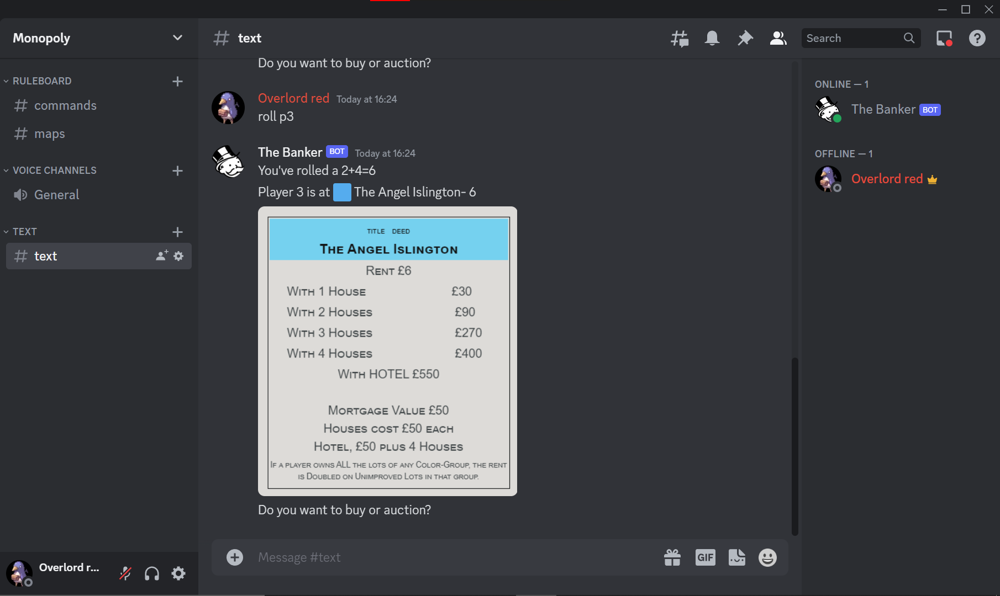

# monopoly-discord-bot
A monopoly bot to help players play the game online on a discord chat




## Setup
Create a config.txt file and write your bot token in it.

## How to use
Run banker.py

## Commands
* To roll your turn:<br>
```roll p<x>``` where \<x\> is the players number. The bot will automatically keep track of position.<br>
Example: ```roll p1```

* To pick a community chest:<br>
```com``` The bot will give a randomised community chest card.<br>
Example: ```com```

* To pick a chance card:<br>
```cnc``` The bot will give a randomised chance card.<<br>
Example: ```cnc```

* To increase a players account balance:<br>
  ```inc p<x> <val>``` where \<x\> is the players number and \<val\> is the amount to be increased.<br>
  Example: ```inc p1 1200```
  
* To decrease a players account balance:<br>
  ```dec p<x> <val>``` where \<x\> is the players number and \<val\> is the amount to be decreased.<br>
  Example: ```dec p1 1200```
  
* To display a players account balance:<br>
  ```val p<x>``` where \<x\> is the players number.<br>
  Example: ```val p1```
  
* To add a property to player:<br>
  ```prop p<x> gain <num>``` where \<x\> is the players number and /<num/> is the property's index number. (check index.txt)<br>
  Example: ```prop p1 gain 13```
  
 * To remove a property to player:<br>
  ```prop p<x> lose <num>``` where \<x\> is the players number and /<num/> is the property's index number. (check index.txt)<br>
  Example: ```prop p1 lose 13```
  
  * To check propertys of player:<br>
  ```prop p<x> curr``` where \<x\> is the players number.<br>
  Example: ```prop p1 curr```

  * To roll a test dice:<br>
  ```dice``` Rolls two six-sided dice.<br>
  Example: ```dice```

## Even more important
Be viby
